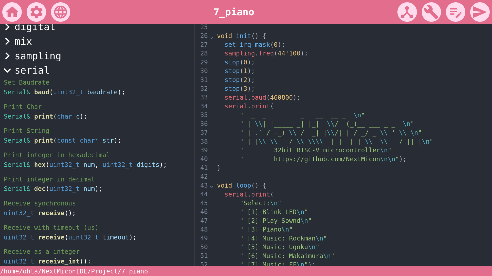

<div align="center">

# Next Micon IDE

**FPGA IDE for Maker**

English | [日本語](doc/README_jp.md)




</div>

## Features

- No HDL: You can edit hardware via GUI. No need to use HDL (Hardware Description Language).
- Comprehensive: Both hardware and software development are completed within this single IDE.
- Lightweight: This IDE is based on a lightweight OSS toolchain. There's no need to install heavy IDEs anymore.

## Dependencies

To use NextMiconIDE, the following tools are required:

- [oss cad suite](https://github.com/YosysHQ/oss-cad-suite-build)
- [RISC-V GNU Compiler Toolchain](https://github.com/riscv-collab/riscv-gnu-toolchain)

## Installation

### Ubuntu

```
curl -fsSL https://raw.githubusercontent.com/NextMicon/NextMiconIDE/main/script/install.sh | sh
```

## License

This project is released under the ~~~.

## Contribution

Contributions are welcome! Please submit feedback and improvement suggestions through Issues and Pull Requests. Some remaining tasks are on [TODO](doc/TODO.md).

## Acknowledgement

Part of this project is supported by the "[IPA MITOU Project](https://www.ipa.go.jp/jinzai/mitou/it/2023/gaiyou_tn-1.html)".
